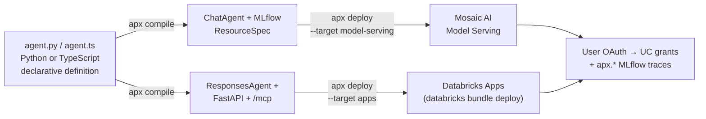

# apx-agent

[](https://github.com/stuagano/apx-agent/actions/workflows/test.yml)
[](https://www.python.org/)
[](LICENSE)

**Write a Databricks AI agent once. Deploy to Model Serving or Databricks Apps with one flag.**

Author your agent in Python or TypeScript. The framework picks the runtime contract (`ChatAgent` for Mosaic AI Model Serving, `ResponsesAgent` for Databricks Apps) and the OBO chain normalizes whichever auth shape the runtime injects — so the calling user's OAuth token flows through every UC function, Genie space, vector index, and sub-agent call. Unity Catalog enforces *their* grants on *their* data; no auth code at the tool level.

```python
from apx_agent import Agent, uc_function_tool, genie_tool

agent = Agent(
    instructions="Investigate customer accounts.",
    tools=[
        uc_function_tool("main.tools.lookup_account"),
        genie_tool("abc123", description="Answer billing questions"),
    ],
)
```

```bash
apx deploy --target model-serving --name main.agents.account_lookup
# or
apx deploy --target apps
```

Same agent code. Same tools. Same `apx.*` MLflow trace schema either way.

### Don't want to write code?

[**apx-builder**](python/examples/apx-builder/) is a natural-language agent builder shipped as an example app. Describe what you want; it scaffolds the project, wires the tools, deploys it, and polls until it's live.

### See what you built

Every deployed agent ships with `/_apx/topology` — an interactive graph of agents, tools, sub-agents, and the UC / Genie / Vector Search / serving-endpoint resources they reach. Click any node for its details.


See [docs/dev-ui.md](docs/dev-ui.md) for the full set of `/_apx/*` surfaces.

---

📚 **[Docs](docs/)** · 🚀 **[Quick start](#quick-start)** · 🧪 **[Examples](python/examples/EXAMPLES.md)** · ⚙️ **[CLI](#cli)**

---

## What you get

| | |
|---|---|
| **Two runtimes, one agent** | `--target apps` (ResponsesAgent + `/mcp` + `/invocations`) or `--target model-serving` (ChatAgent + `log_agent` + `databricks.agents.deploy`) |
| **Identity passthrough** | Calling user's OAuth token flows through every tool call. UC grants enforced per-request. |
| **Governed primitives** | `uc_function_tool`, `genie_tool`, `vector_search_tool` — every tool declares as a Mosaic AI resource so deploy mints scoped tokens automatically |
| **Workflow agents** | `SequentialAgent`, `ParallelAgent`, `LoopAgent`, `RouterAgent`, `HandoffAgent` — deterministic composition |
| **Remote sub-agents** | `agent_tool` wraps any local or remote agent. URL shorthand auto-wraps via A2A discovery. |
| **MCP-native** | `/mcp` endpoint on every Apps deploy. Genie + Genie Code consume tools over standard MCP. |
| **Sessions + memory** | Sessions = named threads: `session_id` ties turns together; history auto-loaded each turn. `LakebaseSessionStore` (~1–10 ms, chat-style), `DeltaSessionStore` (durable, long-idle), `InMemorySessionStore` (dev). Plus `MemoryBank` for durable cross-session recall and `ExampleStore` for few-shot retrieval. |
| **Compliance hooks** | Watchdog adapter, audit log schema, local guards, cost tracking, callbacks |
| **Evaluation** | `apx eval` against MLflow experiments with custom judges |
| **Dev UI** | `/_apx/agent` — traces, eval, tool editor, setup wizard |
| **Visual builder** | `apx-builder` example: describe an agent in English → scaffold + deploy |
| **CLI** | `apx init`, `apx dev`, `apx deploy`, `apx eval`, `apx publish` |

## Architecture



## Quick start

> Not on PyPI / npm yet — install from this repo until the first release.

### Python

```bash
git clone https://github.com/stuagano/apx-agent.git
cd apx-agent/python
uv sync                                    # install framework
uv run apx init my-agent && cd my-agent
uv sync                                    # install agent deps
uv run apx run                             # local dev server on :8000
uv run apx deploy --target apps            # or --target model-serving
```

### TypeScript

```bash
git clone https://github.com/stuagano/apx-agent.git
cd apx-agent/typescript
npm install && npm run build
npx apx scaffold my-agent && cd my-agent
npm install
npx apx run
npx apx deploy --target apps
```

See [docs/getting-started.md](docs/getting-started.md) for the longer walkthrough.

## Workflow patterns

| Pattern | When |
|---|---|
| `SequentialAgent` | Pipeline (analyze → plan → execute) |
| `ParallelAgent` | Fan-out / gather (weather + news concurrently) |
| `LoopAgent` | Iterative refinement (draft → review → revise) |
| `RouterAgent` | Deterministic routing (billing → bill agent) |
| `HandoffAgent` | Peer handoff mid-conversation (triage → specialist) |
| `RemoteAgent` | Cross-endpoint sub-agent call (A2A) |
| `agent_tool` | LLM-driven delegation (wrap any agent as a tool on a parent `LlmAgent`) |

```python
from apx_agent import Agent, SequentialAgent

investigation = SequentialAgent(
    agents=[presence, lineage, pipeline, code, synthesis],
    instructions="Investigate why data is missing.",
)
```

See [docs/workflow-patterns.md](docs/workflow-patterns.md) for full examples and decision criteria.

## Examples

13 worked examples under [`python/examples/`](python/examples/EXAMPLES.md):

| Example | What it shows |
|---|---|
| **memory_demo** | MemoryBank + ExampleStore — recall across handoffs |
| **customer_triage** | HandoffAgent + memory + UC tools |
| **data-triage-agent** | 6-step SequentialAgent (presence → lineage → pipeline → genie → code → synthesis) |
| **data-inspector** | Delta forensics + UC discovery, callable via MCP |
| **entity-resolution-agent** | Fuzzy account match via Vector Search + HandoffAgent (Supervisor + Evaluator) |
| **eligibility-agent** | Document-based program eligibility (PDFs, W-2s, paystubs) |
| **contract-parsing-agent** | Contract PDF → structured fields in UC |
| **shortage-intelligence-agent** | 5-step SequentialAgent for demand cluster detection |
| **explain-my-bill-agent** | Energy billing Q&A over UC tables |
| **slack-agent** | Slack-initiated agent runs as the Slack user's Databricks identity |
| **apx-builder** | Describe-an-agent → scaffold + deploy via NL |
| **agent-hub** | Central registry + chat UI for deployed agents |
| **voynich** | LoopAgent + 5-agent evolutionary population |

Plus 3 supporting services (`account-search-service`, `afr-enrollment-api`, `agent-hub`) and the parallel Claude-Code stack (`databricks-builder-app`, `databricks-mcp-server`, `databricks-tools-core`, `databricks-skills`).

## CLI

```bash
apx init <name>                    # scaffold a new agent
apx dev                            # local FastAPI dev server (/_apx/agent)
apx eval                           # run evalset.jsonl against deployed endpoint
apx deploy --target apps           # deploy to Databricks Apps
apx deploy --target model-serving --name catalog.schema.agent
apx publish --hub-url <url>        # register with an agent hub
```

See [docs/cli.md](docs/cli.md) for the full surface.

## Deeper docs

| Topic | Doc |
|---|---|
| Apps vs Model Serving — when to pick which | [docs/apps-vs-model-serving.md](docs/apps-vs-model-serving.md) |
| Governed primitives + UC function authoring | [docs/governed-primitives.md](docs/governed-primitives.md) |
| Identity passthrough + OBO mechanics | [docs/identity-passthrough.md](docs/identity-passthrough.md) |
| Workflow patterns + decision criteria | [docs/workflow-patterns.md](docs/workflow-patterns.md) |
| Sessions + memory bank + example bank | [docs/sessions-and-memory.md](docs/sessions-and-memory.md) |
| MCP + A2A discovery | [docs/mcp-and-a2a.md](docs/mcp-and-a2a.md) |
| Evaluation + MLflow experiments | [docs/evaluation.md](docs/evaluation.md) |
| Compliance — Watchdog, audit log, local guards | [docs/compliance.md](docs/compliance.md) |
| Cost tracking + callbacks | [docs/cost-and-callbacks.md](docs/cost-and-callbacks.md) |
| Hub + agent publishing | [docs/hub.md](docs/hub.md) |
| Dev UI | [docs/dev-ui.md](docs/dev-ui.md) |

## Project structure

```
python/
  src/apx_agent/        # framework source
  examples/             # 13 worked examples — see EXAMPLES.md
  tests/                # framework tests
typescript/
  src/                  # framework source
  examples/             # 2 worked examples
docs/                   # design docs + deeper guides
```

## For AI coding assistants

The repo ships an [`llms.txt`](llms.txt) index of all documentation URLs in the [llmstxt.org](https://llmstxt.org) format. Add the docs as a local MCP server in Claude Code so you can query them inline:

```bash
claude mcp add apx-agent-docs --transport stdio -- \
  uvx --from mcpdoc mcpdoc \
  --urls "apxAgent:https://raw.githubusercontent.com/stuagano/apx-agent/main/llms.txt" \
  --transport stdio
```

Or add it to your project's `.mcp.json`:

```json
{
  "mcpServers": {
    "apx-agent-docs": {
      "command": "uvx",
      "args": [
        "--from", "mcpdoc", "mcpdoc",
        "--urls", "apxAgent:https://raw.githubusercontent.com/stuagano/apx-agent/main/llms.txt",
        "--transport", "stdio"
      ]
    }
  }
}
```

## License

Apache 2.0 — see [LICENSE](LICENSE).
