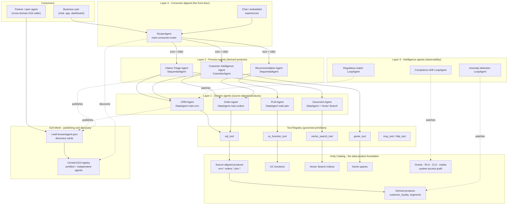

# From Data Products to Agent Products — the Agent Mesh

**Status:** thought-leadership / reference · **Date:** 2026-09-29

A design doc for extending a Unity Catalog data-product blueprint into a
governed **agent mesh**. Companion to
[`agent-governance-for-uc-data-architectures.md`](agent-governance-for-uc-data-architectures.md)
(which answers *"how do we govern the agents?"*) — this doc answers the next
question an at-scale customer asks: *"how do we organize, publish, and compose
them?"*

---

## The insight

The FINS SSA Unity Catalog Design Blueprint lays out a rigorous framework for
how enterprises organize, govern, publish, and consume **data products** on
Databricks: data boundaries, ownership models, publishing topologies
(harmonized vs. hub-and-spoke), SDLC isolation, PII handling, and the full
privilege model.

The apx-agent thesis: **agents are the next layer of data products.** Every
pattern in the blueprint — domains, ownership, publishing, governance,
isolation, discovery — has a direct analog in the agent world. The blueprint
already hints at this: its data-product table lists *"AI Agent Systems"* as a
data-product category alongside datasets, models, and consumption channels.

The UC Design Blueprint is the foundation. The agent mesh is the next floor.
This is not a new architecture — it is the **same architecture, one principal
wider and one layer taller.**

---

## Data products → agent products: the mapping

| UC blueprint concept | Data product world | Agent product world |
|---|---|---|
| **Data domain** | A business unit's tables, views, metrics in UC | A business unit's `DataAgent` grounded in that same UC schema |
| **Data product owner** | Team responsible for data quality, SLAs, contracts | Team responsible for agent behavior, accuracy, guardrails |
| **3-level namespace** | `catalog.schema.table` | `catalog.schema.agent` — agents registered as UC assets with the same isolation |
| **Data contract** | Schema, quality checks, SLAs, security, usage policies | Agent contract: instructions, tools, guardrails, SLAs, identity-passthrough rules |
| **Medallion architecture** | bronze → silver → gold refinement | raw tools → composed agents → production agent products |
| **Source-aligned products** | CRM tables, order data, PLM data | Source-aligned agents: CRM Agent, Order Agent, PLM Agent |
| **Derived products** | `customer_loyalty`, `customer_segments`, `recommendations` | Derived agents: Customer Intelligence Agent, Recommendation Agent |
| **Consumer-aligned products** | Dashboards, reports, alerts | Consumer-aligned agents: `RouterAgent` (the front door), chat interfaces, embedded agents |
| **Publishing (push/pull)** | BU publishes tables to a central catalog | BU publishes agents to a central A2A registry |
| **Discovery** | UC catalog, search, lineage | A2A discovery cards at `/.well-known/agent.json` |
| **Access control** | UC grants, RLS, column masking | UC identity passthrough through agent chains |
| **SDLC isolation** | dev/stg/prd catalogs per BU | dev/stg/prd agent deployments per BU |
| **Hub-and-spoke topology** | Central BU publishes certified data products | Central team publishes certified agent products; BUs publish domain agents |
| **Workspace binding** | Catalogs bound to specific workspaces | Agents deployed to specific Apps / serving endpoints, bound to workspace |
| **PII / compliance** | DIZ (de-identification zone), encryption, masking | Agent guardrails, identity passthrough, compliance agents |

---

## The five layers, revisited through the blueprint lens

The apx-agent mesh has five layers. Each maps to a blueprint concept.

### Layer 1 — Domain agents = source-aligned data products

The blueprint says every data domain (CRM, Orders, PLM, Manufacturing, SCM)
produces source-aligned data products — tables that represent the operational
system with minimal transformation. In the agent world, **every data domain
gets a source-aligned agent** — a `DataAgent` grounded in that domain's UC
schema. The CRM domain gets a CRM Agent. The Order domain gets an Order Agent.
Each knows its tables, its metrics, its business rules; each is owned by the
domain team, just like the data product.

```
Data product:  main.crm.customers        (table)
Agent product: main.crm.crm_agent        (DataAgent grounded in the crm schema)
```

A `DataAgent("main", "crm")` discovers the schema, grounds its instructions in
the real columns, and wires a SQL tool that runs **as the calling user** — so
the domain's existing UC grants are the agent's guardrails from line one.

### Layer 2 — Process agents = derived data products

The blueprint defines derived data products — created by processing and
transforming source-aligned products. `customer_loyalty` is derived from CRM +
Orders; `customer_segments` from CRM + clickstream.

In the agent world, **process agents are derived from domain agents.** A Claims
Triage Agent is a `SequentialAgent` composing Policy + Document + Routing
agents. A Customer Intelligence Agent is a `CoworkerAgent` reconciling CRM with
clickstream through a shared customer ID.

The key blueprint insight carries over: **derived products have clear ownership
and contracts.** Someone owns the Claims Triage Agent, defines its contract
(instructions, tools, guardrails, SLAs), and is responsible for its quality.

### Layer 3 — Intelligence agents = observability & monitoring

The blueprint covers Lakehouse Monitoring, system tables, and data-quality
analytics — the always-on observability layer. In the agent world,
**Intelligence Agents are `LoopAgent` patterns** that continuously monitor
compliance drift, regulatory change, anomaly detection, and proactive alerts.
They are the agent equivalent of Lakehouse Monitoring: always running, pushing
insights rather than waiting for questions.

### Layer 4 — The router = consumer-aligned data products

The blueprint's consumer-aligned products are built for end users — dashboards,
reports, alerts, chat interfaces. They are the consumption layer.

The **`RouterAgent` is the consumer-aligned agent product.** It is the front
door: users don't need to know which domain agent to ask — they just ask. The
router routes to the right specialist, just as a dashboard routes to the right
data product.

### Layer 5 — The A2A mesh = publishing topology

This is where the blueprint's publishing patterns become the agent-mesh
architecture:

- **Harmonized (distributed).** Each domain hosts and serves its own agents. A
  global registry (A2A discovery cards) enables cross-domain discovery. Each
  domain is autonomous — it builds, deploys, and manages its own agents. A
  central platform team defines the blueprint (apx-agent framework, deployment
  patterns, governance rules) but does not operate the agents.
- **Hub-and-spoke (centralized).** A central team operates a hub of certified
  agent products. Domain teams publish agents to the hub. The hub applies
  quality assurance and governance and makes agents discoverable. Domain agents
  are consumed only through the hub.

**Recommendation (same as the blueprint):** start hub-and-spoke, evolve to
harmonized as domains mature. The central team defines the apx-agent blueprint,
provides scaffolding and deployment automation, and certifies agent products.
As domains build capability they become autonomous — publishing their own
agents with A2A discovery, governed by UC identity passthrough.

---

## Architecture: the agent mesh on the UC foundation

The diagram shows the whole stack: the UC data-product foundation at the
bottom, the five agent layers above it, and the governance plane cutting
through every layer. A user asks at the router (Layer 4); the router delegates
over A2A to process agents (Layer 2), which compose domain agents (Layer 1);
domain agents ground in UC data products. Intelligence agents (Layer 3) monitor
the whole mesh. Every hop carries the user's OBO identity so the RLS/CLS/masks
designed for humans bite on the agent's queries too.



**How to read it:** solid arrows are the request path (a question flowing down
to governed data). Dotted arrows are the control plane — monitoring and
publication/discovery. The governance plane (`GRANTS`) sits inside UC and
applies to every tool call because each agent runs its data access **as the
calling user**.

---

## Agent contracts = data contracts

The blueprint defines a data contract with: description, schema, quality
checks, SLAs, security, usage policies. The agent equivalent:

| Data contract element | Agent contract element |
|---|---|
| Name, owner, description | Agent name, owning team, instructions |
| Data schema | Tool schema (UC functions, Genie spaces, Vector Search indices) |
| Quality checks | Evaluation suite (accuracy, hallucination rate, tool-call correctness) |
| SLAs | Latency SLAs, availability, max iterations |
| Security | UC identity-passthrough config, guardrails, PII-handling rules |
| Usage policies | Rate limits, approved use cases, A2A caller restrictions |
| Explanatory add-ons | Example conversations, few-shot prompts, domain glossary |

In apx-agent the contract is **declared, not wired**: identity is a per-tool
`ExecutionIdentity = "user" | "service"` declaration, scopes are derived and
least-privilege at deploy time, and the evaluation/quality bar is a caps-style
proof (`*_reality_ctk.py`) rather than a slide claim. The deploy reads the
contract back — Ctk for agents, exactly as the blueprint's contract is the
read-back for data.

---

## The registries

Two registries make the mesh discoverable and composable; both ride on
primitives the customer already runs.

### Agent registry (A2A)

- Each Apps-hosted agent publishes a discovery card at
  `/.well-known/agent.json` — logical name, description, capabilities, skills,
  and MCP endpoint.
- A **central registry** aggregates the cards. In hub-and-spoke it is the
  *only* consumption path; in harmonized mode it is a discovery index over
  autonomous domains.
- Consumers bind **by logical name**, not by URL:
  `[tool.apx.agent.bindings] pricing = "$PRICING_APP_URL"`. The graph stays
  about roles; the transport resolves at deploy. This is the agent analog of
  referencing a table by `catalog.schema.table` rather than by storage path.

### Tool registry (governed primitives)

- The built-in governed primitives — `sql_tool`, `genie_tool`,
  `vector_search_tool`, `uc_function_tool` — are the agent's *typed* access to
  UC assets. Each carries an identity declaration, so the tool schema **is** a
  slice of the data contract.
- Custom/advanced tools (`http_tool`, `openapi_tool`, `mcp_tool`,
  `mcp_toolkit`) extend the registry to non-UC systems, still behind the same
  per-tool identity and approval model.

The two registries are the mesh's contract surface: **agents are discovered
through A2A cards; data is reached through governed tools; both are bound by
name and gated by UC.**

---

## Agent lifecycle = data-product lifecycle

The blueprint's phased rollout applies directly:

- **Phase 1 — Core agent team.** Define the apx-agent blueprint. Build
  templates, scaffolding, shared governance. Sell the approach to business
  domains. Deploy the first domain agent as a proof point.
- **Phase 2 — First autonomous domain.** One BU builds and deploys its own
  agents using the blueprint. Adapt the framework from what they learn. Connect
  via A2A to the central agents.
- **Phase 3 — Dependent domains.** BUs that aren't yet self-sufficient get
  hub-supported agent products. The central team provides publishing
  infrastructure and lightweight governance.
- **Phase 4 — Full rollout.** Approach finalized; roll out to the rest of the
  organization. Every domain has agents. The A2A mesh connects them all. UC
  governance flows through every call.

---

## Certified vs. independent agent products

The blueprint distinguishes **certified** data products (approved by the
governance team, semantically consistent, composable) from **independent** ones
(domain-published, high quality but no cross-domain consistency guarantee). The
same applies to agents:

- **Certified agent products.** Approved by the central team. Follow the agent
  contract standard. Evaluated against the shared evaluation suite. Published
  to the central A2A registry. Composable with other certified agents.
- **Independent agent products.** Domain-published. May use custom tools or
  non-standard patterns. High quality within their domain but not guaranteed to
  compose cleanly with agents from other domains.

Independent agents can be **elevated to certified** by following the governance
process — just like data products.

---

## The consumption multiplier — why this matters for GTM

The blueprint organizes data. The agent mesh **activates** it. Every data
product in the UC catalog is a potential agent grounding source; every UC
function a potential agent tool; every Genie space a potential delegation
target.

The math: a customer with 50 data products in UC and 5 domain agents generates
**3–5× more platform AI consumption** than the same customer with just the data
products — because agents don't just store data, they reason over it,
continuously, for hundreds of users, touching Vector Search + Agent Bricks +
Model Serving + serverless SQL + Lakebase on every call.

The UC Design Blueprint builds the data foundation. apx-agent builds the agent
layer on top. Together they turn a governed data platform into a governed,
agent-native enterprise.

---

## The pitch to FINS SSA

You already have the UC Design Blueprint. Your customers are already building
data products, defining ownership, establishing governance. The next question
they'll ask is: *"How do we put AI agents on top of this?"*

The answer: **the same patterns apply.** Domains become domain agents. Data
contracts become agent contracts. Publishing topologies become A2A mesh
topologies. UC governance becomes agent governance via identity passthrough.

The blueprint extends naturally — it is not a new architecture, it is the next
layer of the same architecture. apx-agent is the framework that makes it
buildable; the UC Design Blueprint is the foundation that makes it governable.

---

## See also

- [`agent-governance-for-uc-data-architectures.md`](agent-governance-for-uc-data-architectures.md) — the governance half: whose grants gate an agent's actions
- [`agent-governance-architecture-deepdive.md`](agent-governance-architecture-deepdive.md) — the slide-by-slide narrative companion
- [`caps-capability-contracts.md`](caps-capability-contracts.md) — how agent contracts become provable promises
- [`../multi-agent/a2a.md`](../multi-agent/a2a.md) — the A2A discovery, binding, and per-hop OBO mechanics this doc builds on
