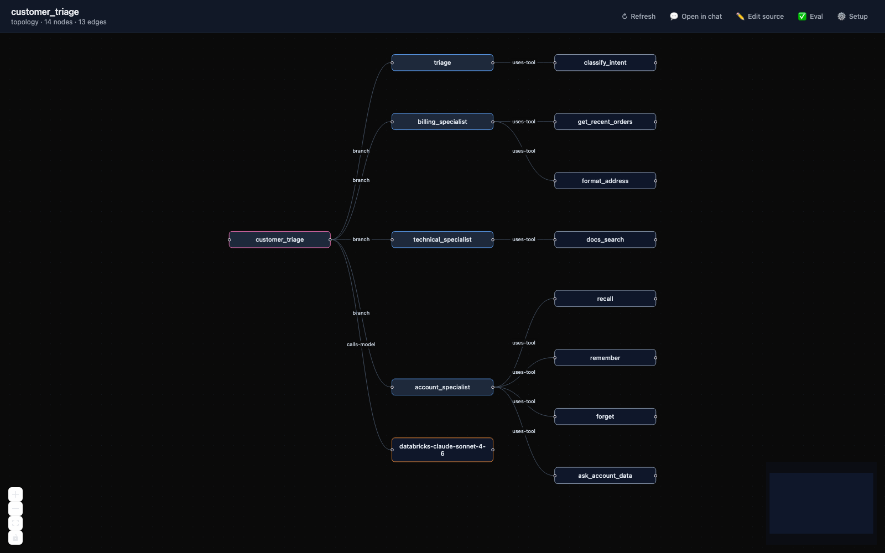

# Dev UI

Apps-hosted agents include built-in development tooling under the `/_apx/*` path. Each surface is self-contained and styled to a shared dark theme; a fixed header (rendered by `_ui_nav.py`) lets you jump between them.

Model Serving deployments use AI Playground as the equivalent surface.

## Surfaces

### `/_apx/agent` — Chat
Interactive chat interface for testing the running agent. Streams responses, surfaces tool calls inline, and shows a setup banner if `[tool.apx.agent]` isn't configured. Use this to exercise the agent end-to-end while iterating.

### `/_apx/tools` — Tool inspector
Lists every tool exposed by the agent (typed Python tools, `uc_function_tool`, `genie_tool`, `vector_search_tool`, etc.) with their JSON Schemas and a live "invoke" form for each. Useful for verifying tool wiring without going through the LLM.

### `/_apx/topology` — Interactive topology graph



A React-flow visualization of the agent topology: agent nodes, tools, sub-agents, and platform resources (UC functions, Genie spaces, vector indexes, serving endpoints), connected by typed edges (`uses-tool`, `delegates-to`, `calls-model`, `next-step`, `branch`, `iterates`). Click any node to inspect its details in a side panel — instructions, model, JSON Schema, resource identifier, or sub-agent URL. View-only in v1; no in-graph editing or live trace overlay yet.

Color coding follows NodeType: pink stroke for routing agents (`HandoffAgent`, `RouterAgent`), blue for `LlmAgent`, slate for tools, green/yellow/cyan/orange for UC functions / Genie spaces / vector indexes / serving endpoints respectively. Selection highlights the node and its incident edges.

Data is served from `GET /_apx/topology.json` (full graph) and `GET /_apx/topology/inspect/{node_id}` (per-node details). See the [topology spec](superpowers/specs/2026-05-22-topology-ui.md) for the full schema.

### `/_apx/edit` — Edit agent source
Loads the agent's `agent_router.py` (or equivalent entry module) into a browser editor with a preview-diff endpoint. Save writes the file and the dev server hot-reloads.

### `/_apx/probe` — Outbound connectivity tester
Pass `?url=<url>` to verify outbound network reachability from the App. Pairs with `/_apx/probe/checks` for a curated list of common Databricks endpoints (control plane, model serving, UC, Genie). Useful when an App can't reach a managed MCP / vector index / endpoint.

### `/_apx/setup` — First-run wizard
Picks a catalog/schema, a SQL warehouse, and seeds suggested tools and agent instructions. Writes to `pyproject.toml` and the project's `.env` so the next reload comes up configured. Surfaces a nudge from `/_apx/agent` when `DEMO_CATALOG` / `WAREHOUSE_ID` aren't set.

### `/_apx/eval` — Evalset + judge
Stores evaluation rows (`/_apx/eval/data`), runs them through the agent, and scores responses with an LLM-as-judge (`/_apx/eval/judge`). Lightweight regression harness for iterating on prompts and tool wiring.

### `/_apx/builder` — Visual agent builder
A node-based canvas for composing agents without writing Python by hand. Drop tools onto nodes, wire up Sequential / Router / KeywordRouter compositions, save, and the dev server hot-reloads the generated `agent.py`. Switch to `/_apx/agent` to test it. Switch to `/_apx/traces` to debug it.

#### What it does

Drag-drop canvas with node types matching apx-agent's primitives — LLM (`Agent`), Supervisor (`SequentialAgent`), Router (`RouterAgent` or `KeywordRouter` depending on routing mode), Vector Search, UC Function, Lakebase. Connect nodes with edges to express composition. Hit Save → the canvas writes an idiomatic apx-agent `agent.py` to the project's working directory plus a `.apx-builder.json` sidecar capturing the layout.

#### What it doesn't do (v1)

- **No round-trip from hand-edited `agent.py` back into the canvas.** The canvas reopens via `.apx-builder.json`. If you save with the canvas, then hand-edit `agent.py`, those edits won't appear if you reload the canvas — your edits stay in `agent.py`, the canvas just shows the last-saved graph.
- **No custom `@tool` decorator support.** v1 only emits factory tool calls (`uc_function_tool`, `vector_search_tool`, `genie_tool`). Custom Python tools defined with `@tool` stay hand-written in `tools.py`.
- **No multi-file projects.** Save only writes `agent.py`. If your project has `tools.py` or `prompts.py`, those stay hand-written; the canvas references them by import.
- **No live test runner inside the canvas.** Test by switching to the `/_apx/agent` chat tab — keeps responsibilities separated.

#### Opting out

The builder is included in the framework wheel. If you don't want it in a deployment, the route still serves but the `/_apx/builder/save` endpoint can be disabled via a future config knob (TODO). To not see the Builder tab at all, override the nav in your dev UI (custom `_ui_nav.py`).

## Build the topology UI

The topology surface is a Vite + React SPA in `python/dev-ui/topology/`. Maintainers rebuild it before publishing the wheel:

```bash
cd python/dev-ui/topology
npm install                 # one-time
npm run build               # tsc --noEmit + vite build
```

The build outputs to `python/src/apx_agent/_static/topology/` (`index.html`, `assets/*.js`, `assets/*.css`). The wheel ships that directory via `hatch`'s `force-include`:

```toml
[tool.hatch.build.targets.wheel.force-include]
"src/apx_agent/_static/topology" = "apx_agent/_static/topology"
```

End users get a working UI from `pip install apx-agent` without needing Node installed.

## Build the visual builder

The builder SPA lives at `python/builder-ui/`. To rebuild after editing canvas code:

    cd python/builder-ui && npm run build:dist

This writes static assets into `python/src/apx_agent/_builder_ui_dist/`, which the framework wheel ships via `hatch`'s `force-include`.
