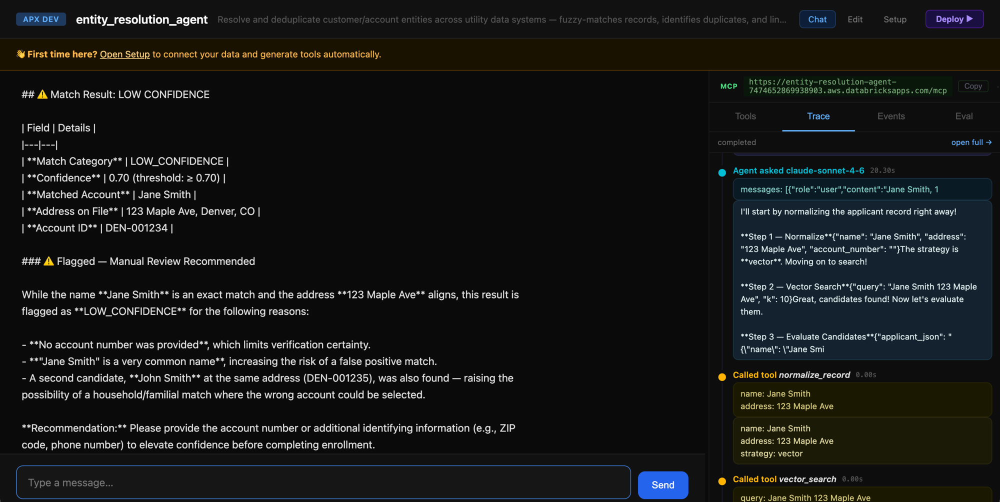

# Entity Resolution Agent

Fuzzy-match and resolve customer/account entities built on [apx-agent](https://github.com/stuagano/apx-agent) and Databricks — **two specialized agents, under 300 lines of Python**.


Two `LlmAgent`s collaborate via `HandoffAgent`: a **Supervisor** that normalizes records and searches, and an **Evaluator** that scores candidates and logs decisions. The trace panel shows every tool call, input, and output in real time.

---

## What makes this simple

Two focused agents, each wired in a handful of lines:

```python
# core/supervisor.py
supervisor = LlmAgent(
    tools=[normalize_record, vector_search, sql_search],
    instructions=SUPERVISOR_INSTRUCTIONS,
    max_iterations=6,
)

# core/evaluator.py
evaluator = LlmAgent(
    tools=[evaluate_candidates, log_decision],
    instructions=EVALUATOR_INSTRUCTIONS,
    max_iterations=4,
)

# agent_router.py — HandoffAgent wires them together
agent = HandoffAgent(
    agents={"supervisor": supervisor, "evaluator": evaluator},
    start="supervisor",
    max_handoffs=4,
)
```

Tools are just regular Python functions. Databricks auth is handled automatically via `Dependencies.Workspace`:

```python
def vector_search(query: str, k: int = 10, ws: Workspace = None) -> dict:
    """Search the VS index for candidate accounts matching the query."""
    index = ws.vector_search_indexes.query_index(
        index_name=os.environ["VECTOR_SEARCH_INDEX_NAME"],
        columns=["account_id", "name", "address"],
        query_text=query,
        num_results=k,
    )
    ...
```

No boilerplate. No auth wiring. `ws` is injected per-request with the caller's OBO token on Databricks Apps, or falls back to CLI credentials locally.



---

## Pipeline

```
"Match Jane Smith at 123 Maple Ave"
           │
           ▼
    ┌─── SUPERVISOR ───────────────────────────────┐
    │  normalize_record  → cleaned name/address,   │
    │                      strategy (vector | sql) │
    │  vector_search     → top-k from VS index     │
    │  sql_search        → ILIKE fallback for      │
    │                      initials / acronyms     │
    └──────────────────────────────────────────────┘
           │  candidate shortlist → hand off
           ▼
    ┌─── EVALUATOR ────────────────────────────────┐
    │  evaluate_candidates → confidence score,     │
    │                        edge case detection   │
    │  log_decision        → Delta audit table     │
    └──────────────────────────────────────────────┘
           │  low confidence? hand back to Supervisor
           │  with search hints (up to 4 handoffs)
           ▼
        result to user
```

---

## Quick Start

```bash
uv sync

# Run in demo mode — no VS index or SQL warehouse needed
DEMO_MODE=true uv run uvicorn entity_resolution_agent.backend.app:app --port 8001
```

Open `http://localhost:8001` and try:

| Prompt | What it exercises |
|--------|-------------------|
| `Match Jane Smith at 123 Maple Ave` | Vector search → LOW_CONFIDENCE (common name, no account number) |
| `Match Jane Smith at 123 Maple Ave, account 9876` | Same + account number exact-match boost → HIGH_CONFIDENCE |
| `Match J. Smith at 567 Birch Lane` | Initials → SQL fallback path |
| `Match Liz Rodriguez at 456 Oak Street` | Nickname variant |
| `Match John Smith at 123 Maple Ave` | Familial match flagged (same address, different first name) |

```bash
uv run pytest tests/ -v
```

---

## Configuration

| Env var | Demo | Production |
|---------|------|------------|
| `DEMO_MODE` | `true` | `false` |
| `VECTOR_SEARCH_ENDPOINT_NAME` | _(ignored)_ | Your VS endpoint |
| `VECTOR_SEARCH_INDEX_NAME` | _(ignored)_ | `catalog.schema.account_idx` |
| `ACCOUNT_TABLE` | _(ignored)_ | `catalog.schema.accounts` |
| `DECISION_TABLE` | _(ignored)_ | `catalog.schema.match_decisions` |

---

## Project Structure

```
entity-resolution-agent/
├── src/entity_resolution_agent/backend/
│   ├── agent_router.py        # HandoffAgent wiring — 10 lines
│   ├── app.py                 # FastAPI app — 8 lines
│   ├── models.py              # Application, Candidate, MatchDecision
│   └── core/
│       ├── supervisor.py      # normalize_record, vector_search, sql_search
│       ├── evaluator.py       # evaluate_candidates, log_decision + edge case logic
│       └── demo_data.py       # 15 synthetic accounts for DEMO_MODE
└── tests/
    ├── test_supervisor_tools.py
    ├── test_evaluator_tools.py
    └── test_agent_wiring.py
```

---

## Edge Cases

| Case | Mechanism |
|------|-----------|
| Initials (`J. Smith`) | Regex → `strategy="sql"` → `sql_search` ILIKE |
| Acronyms (`ABC LLC`) | Same |
| Familial match | Same address + same surname + different first → flagged in rationale |
| Account number match | +0.05 confidence boost |
| No candidates | Tries alternate search tool before returning NO_MATCH |
| LOW_CONFIDENCE | Category returned, manual review recommended |
